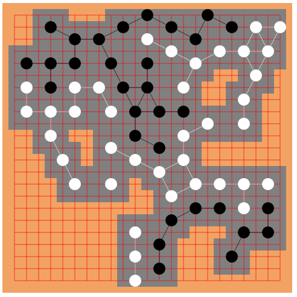

# Gengo

The is a python application/web server that runs a generalized version of go in which a stone extends across multiple spaces. Here's an example a 23x23 board from near the end of the game.



## Rules

Gengo is a generalized version of go that allows stones to be placed on a finer-grained grid. Stones have an a overlap region in which other stones cannot be played, and a neighbor region (beyond the immediate adjacent stones) in which stones are considered to be neighbors. For the full rules look [here](Rules.md).

## Usage

### Command-line application

To run the python program, from this directory do

```
python gengo.py
```

Several options exists to play for rules; see `python gengo.py -h` for more information.

Enter a move as a tuple of a row and a column, e.g.
```
2,3
```
A move can be undone with `u`; no entry is a pass.

### Web application

To run gengo on the web, start both a game server and a web server.

To start the game server, from this directory do
```
python start_server.py
```

To start the web server: from the `gengo/app` directory, do

```
export FLASK_APP=routes.py
flask run --host=0.0.0.0
```

(for a developement server, do `export FLASK_ENV=development` first).
This starts a server on port 5000. Point a browser to http://localhost:5000/new and enter the name of the game, the board size and any other options. Point a second browser to http://localhost:5000/join and click on the appropriate game.

To connect to the web server from a client on another machine, ensure the firewall allows access to ports 5000 and 8765 (for websocket connections to the game server).

### Tests

To run tests, do `pytest` from this directory.

Note that this is still in alpha and is mostly useful for understanding the game.