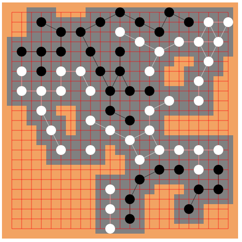

# Gengo

This is a python application/web server that runs a generalized version of go in which a stone extends across multiple spaces. Here's an example a 23x23 board from near the end of the game.



## Rules

Gengo is a generalized version of go that allows stones to be placed on a finer-grained grid. Stones have an a overlap region in which other stones cannot be played, and a neighbor region (beyond the immediate adjacent stones) in which stones are considered to be neighbors. For the full rules look [here](Rules.md).

## Getting started

### Setup

Python 3.11, as in the deployed images (3.8 and 3.10 also work).

```
python3 -m venv .venv
source .venv/bin/activate
pip install -r requirements.txt
```

### Command-line application

To run the python program, from this directory do

```
python gengo/src/gengo.py
```

Several options exists to play for rules; see `python gengo/src/gengo.py -h` for more information.

Enter a move as a tuple of a row and a column, e.g.
```
2,3
```
A move can be undone with `u`; no entry is a pass. Three passes in a row end the game, and `r` resigns.

### Web application

To run gengo on the web, start both a game server and a web server.

To start the game server, from this directory do
```
python start_server.py
```

To start the web server: from the `gengo/app` directory, do

```
export FLASK_APP=routes.py
export GENGO_WS_URL=ws://localhost:8765
flask run --port 5050
```

(for a development server that reloads on changes, add `--debug`).
Point a browser to http://localhost:5050/gengo/ and start a new game, entering its name, the board size and any other options. Point a second browser to the same page and join that game from the list.

`GENGO_WS_URL` tells the pages where the game server is. Without it they connect through `/gengo/ws` on the page's own host, which only the deployed nginx serves. Any free port works for Flask; avoid 5000 on macOS, where AirPlay Receiver holds it.

To play from another machine, run Flask with `--host=0.0.0.0`, set `GENGO_WS_URL` to `ws://<this machine's address>:8765`, and make sure the firewall allows both ports.

### Tests

```
pip install -r requirements-dev.txt
pytest
```

runs the rule, route and game-server tests in a few seconds. The browser tests, which drive the real pages and Brython client against a local game server in Chromium and Firefox, are opt-in:

```
python -m playwright install chromium firefox
pytest --browser-tests
```

`GENGO_BROWSERS` picks the browsers (default `chromium,firefox`). Playwright's WebKit hangs on macOS 14, so Safari is checked by hand.

### Not in this repo

Nothing is needed to play. The `--database` option (on `start_server.py` and the command-line game) saves finished games to a local Postgres database named `gengo`, created from `sql/create_tables.sql`; it is untested, games are never read back, and the deployed site does not use it (see GENGO-3).

The deployment lives in `bennetto-infra`, of which this repo is a submodule: `docker/gengo-web.Dockerfile` runs the web app under gunicorn and `docker/gengo-ws.Dockerfile` the game server, with nginx serving them at `/gengo/` and the websocket at `/gengo/ws`. Deploy through that repo, not from here.

Note that this is still in beta and is mostly useful for understanding the game.