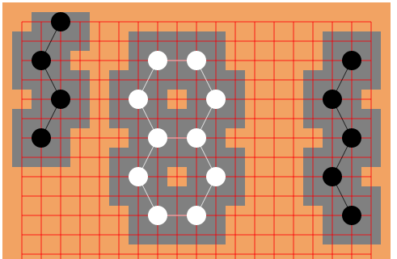

# Generalized Go (Gengo) Rules

## Overview
Gengo is a generalized version of go that allows stones to be placed on a finer-grained grid. Stones have an a overlap region in which other stones cannot be played, and a neighbor region (beyond the immediate adjacent stones) in which stones are considered to be neighbors. 

In ordinary go, the overlap is only the space on which the stone is played, and the neighbors are the four points adjacent to that point.

Gengo can be played with any set of regions, but the default regions look like this:
```
  n n n
n o o o n
n o x o n
n o o o n
  n n n
```
where x is the stone itself, o shows the overlap region, and any stones played at n are neighbors.

## Rules

1. **Overview.** Gengo is played with two players playing black and white. Players alternate plays (starting with black) which consist of either placing *stones* on *spaces* in a square grid, or passing. Once a stone is placed it can never be moved but it can be captured and removed from the board.

2. **Valid plays.** A stone can be placed in any space that is not in the *overlap region* of another stone (exception: see ko, below).

3. **Groups.** Two stones are *connected* if they are in the *neighbor regions* of each other. All stones that can be reached from each other by path of connected stones form a *group*.

4. **Liberties.** A *liberty* of a group is an empty space (i.e., not in the overlap region of any stone) that is in the neighbor region of some stone in the group.

5. **Captures.** A group is *captured* (and all the stones in it are removed) if it has no liberties. After a player moves, first all opposing groups without liberties are captured and removed. Next any of the player's own groups without liberties are captured and removed. (note that suicide and friendly-fire captures are allowed).

6. **Ko.** A player may not make a play if it would capture a single stone, and the stone captured just played by the opponent, and that play captured a single stone. This is similar to the ko rule in ordinary go that prevents repeats.

7. **End of game.** The game is over when there are three passes in a row.

8. **Scoring.** The final score of each player is the number of their stones currently on the board. The player with the most stones is the winner. This is equivalent to the [original scoring method](https://senseis.xmp.net/?StoneScoring) in go, rarely used today.

9. **Handicaps.** The game may be played a **handicap** of two or more stones. If so, the starting (black) player may make that many plays at the beginning of the game before the white player plays.

## Rule Questions

The best rules are not yet clear so some rules may later be changed.

1. Should suicide be legal? (default: yes, option for no)
   * There doesn't seem to be a reason to make it illegal.
2. Should it be legal to kill one's own groups (not connected to the stone played) (currently: yes)
   * If so, should the group with the stone played die
      * before,
      * after, or
      * at the same time as others of that player? (default: same time)
    The current option seems the most logical and easiest to code.
3. Should it be legal to play inside the overlap of one's own stones? (default: no, option for yes)
    * Pro:
        * it avoids the weird inability to connect stones
    * Con:
        * it doesn't solve the friendly-fire problem
        * it makes stone-counting ineffective
        * it feels a little weird
4. How should kos work? (currently singleton recapture)
    * Singleton recapture: this is the best option. It's not standard it any version of go, but it's essentially the same as the (last-move) ko rule in ordinary go. A move here is prohibited if the last play captured a single (opposing) stone, and the move would capture that stone and nothing else.
    * the ordinarily (last-move) Japanese ko rule won't work, as kos might be captured at more than one space so it wouldn't handle many repeated moves.
    * the ordinarily (Chinese style) super-ko rule is an option, but it would be difficult to keep track of whether all the possible positions of a ko were exhausted, and each turn in a ko battle would take several turns.
5. How do we score? (currently: displays Area scoring and Stone scoring)
    * Stone scoring. This is the easiest to count and the most consistent logically, but it's a pain to play. This is particularly true here, where the end becomes a puzzle of squeezing stones in without killing eyes, and it doesn't work if stones can be played inside the one's own overlap.
    * Area scoring. Here we count total number of spaces either overlapped or surrounded by overlapped stones. Spaces overlapped by stones of both color count as neutral.
    * Territory scoring. This might be a bit easier than area counting, but to do this you'd need to specify a ratio of the value of captured stones to surrounded spaces, and there might players could take advantage of that to fill in opponent's territory.
6. What are the best overlap/neighbor regions? (default: see above, other options available)
    * The current regions are chosen to be fairly small (so it's not too confusing) and to have similar behavior to go. One way to measure "similar behavior" is the minimal number of stones to form a live group in the corner, along a side, or in the open. Overall it requires significantly fewer stones to make life it Gengo, suggesting the regions should be tweaked.
    
    Location | Stones in go | Stones in Gengo
    ---------|--------------|-----------------
    Corner   |  6           |  4
    Edge     |  8           |  5
    Center   |  13          |  10

